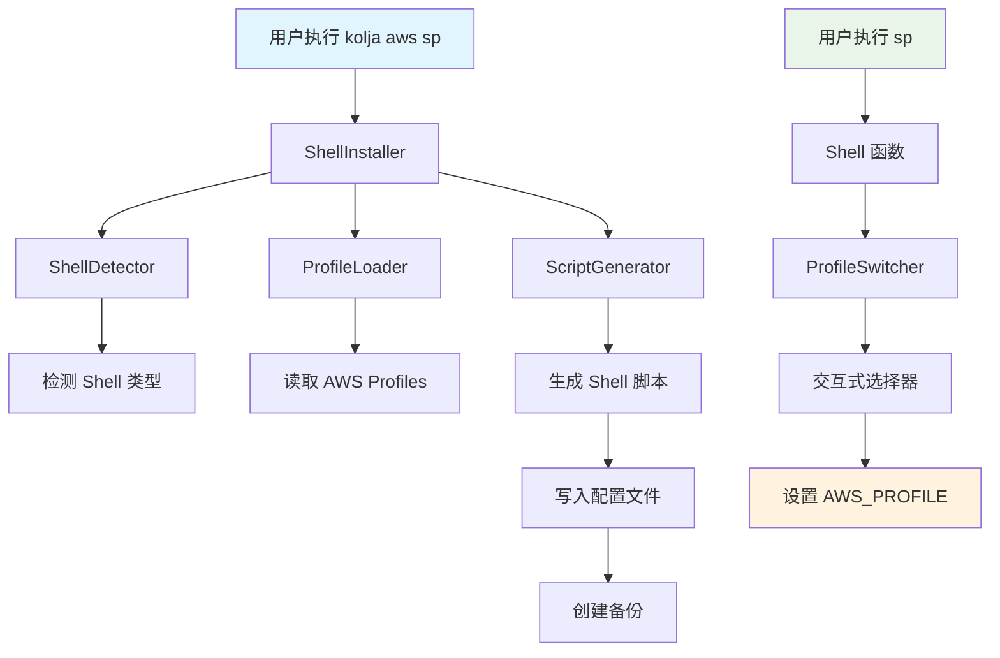

# Design Document

## Overview

Shell Profile Switcher 功能为 kolja-aws 工具添加了一个 shell 集成层，允许用户通过 `kolja aws sp` 命令安装一个交互式的 AWS Profile 切换器到他们的 shell 配置文件中。安装后，用户可以通过简单的 `sp` 命令快速选择和切换 AWS profiles。

该功能的核心设计理念是：
- 无缝集成到现有的 kolja-aws 架构中
- 重用现有的 profile 发现和管理逻辑
- 提供跨平台的 shell 支持（bash, zsh, fish）
- 确保安装过程的安全性和可逆性

## Architecture

### 系统架构图



### 组件关系

1. **安装阶段**：`pip3 install kolja-aws` → post-install hook → ShellInstaller → 配置文件修改
2. **运行阶段**：`sp` → Shell 函数 → ProfileSwitcher → 环境变量设置

## Components and Interfaces

### 1. ShellInstaller 类

负责检测 shell 环境并安装 shell 集成脚本。

```python
class ShellInstaller:
    """Shell 集成安装器"""
    
    def __init__(self):
        self.shell_detector = ShellDetector()
        self.script_generator = ScriptGenerator()
        self.backup_manager = BackupManager()
    
    def install(self) -> bool:
        """安装 shell 集成"""
        pass
    
    def uninstall(self) -> bool:
        """卸载 shell 集成"""
        pass
    
    def is_installed(self) -> bool:
        """检查是否已安装"""
        pass
```

### 2. ShellDetector 类

检测当前使用的 shell 类型和配置文件路径。

```python
class ShellDetector:
    """Shell 环境检测器"""
    
    SUPPORTED_SHELLS = {
        'bash': ['~/.bashrc', '~/.bash_profile'],
        'zsh': ['~/.zshrc'],
        'fish': ['~/.config/fish/config.fish']
    }
    
    def detect_shell(self) -> str:
        """检测当前 shell 类型"""
        pass
    
    def get_config_file(self, shell_type: str) -> str:
        """获取 shell 配置文件路径"""
        pass
    
    def is_shell_supported(self, shell_type: str) -> bool:
        """检查 shell 是否支持"""
        pass
```

### 3. ProfileLoader 类

重用现有的 kolja-aws 逻辑来加载 AWS profiles。

```python
class ProfileLoader:
    """AWS Profile 加载器"""
    
    def __init__(self):
        self.aws_config_path = os.path.expanduser("~/.aws/config")
    
    def load_profiles(self) -> List[str]:
        """加载所有可用的 AWS profiles"""
        pass
    
    def get_current_profile(self) -> Optional[str]:
        """获取当前活动的 profile"""
        pass
    
    def validate_profile(self, profile_name: str) -> bool:
        """验证 profile 是否存在"""
        pass
```

### 4. ScriptGenerator 类

生成特定 shell 的集成脚本。

```python
class ScriptGenerator:
    """Shell 脚本生成器"""
    
    def generate_bash_script(self) -> str:
        """生成 Bash/Zsh 兼容脚本"""
        pass
    
    def generate_fish_script(self) -> str:
        """生成 Fish shell 脚本"""
        pass
    
    def get_script_for_shell(self, shell_type: str) -> str:
        """根据 shell 类型生成对应脚本"""
        pass
```

### 5. ProfileSwitcher 类

处理交互式 profile 选择和环境变量设置。

```python
class ProfileSwitcher:
    """Profile 切换器（在 shell 脚本中调用）"""
    
    def __init__(self):
        self.profile_loader = ProfileLoader()
    
    def show_interactive_menu(self) -> str:
        """显示交互式选择菜单"""
        pass
    
    def switch_profile(self, profile_name: str) -> bool:
        """切换到指定 profile"""
        pass
```

### 6. BackupManager 类

管理配置文件的备份和恢复。

```python
class BackupManager:
    """配置文件备份管理器"""
    
    def create_backup(self, file_path: str) -> str:
        """创建配置文件备份"""
        pass
    
    def restore_backup(self, backup_path: str) -> bool:
        """恢复配置文件备份"""
        pass
    
    def cleanup_old_backups(self, file_path: str, keep_count: int = 5) -> None:
        """清理旧备份文件"""
        pass
```

## Data Models

### ShellConfig 数据模型

```python
@dataclass
class ShellConfig:
    """Shell 配置信息"""
    shell_type: str
    config_file: str
    backup_file: Optional[str] = None
    install_marker: str = "# kolja-aws profile switcher"
    
    def validate(self) -> None:
        """验证配置有效性"""
        if self.shell_type not in ShellDetector.SUPPORTED_SHELLS:
            raise ValueError(f"Unsupported shell: {self.shell_type}")
        
        if not os.path.exists(os.path.expanduser(self.config_file)):
            raise FileNotFoundError(f"Config file not found: {self.config_file}")
```

### ProfileInfo 数据模型

```python
@dataclass
class ProfileInfo:
    """AWS Profile 信息"""
    name: str
    is_current: bool = False
    sso_session: Optional[str] = None
    account_id: Optional[str] = None
    role_name: Optional[str] = None
    
    def __str__(self) -> str:
        marker = " ❯" if self.is_current else "  "
        return f"{marker} {self.name}"
```

## Error Handling

### 异常类层次结构

```python
class ShellIntegrationError(Exception):
    """Shell 集成基础异常"""
    pass

class UnsupportedShellError(ShellIntegrationError):
    """不支持的 Shell 类型"""
    pass

class ConfigFileError(ShellIntegrationError):
    """配置文件操作错误"""
    pass

class ProfileLoadError(ShellIntegrationError):
    """Profile 加载错误"""
    pass

class BackupError(ShellIntegrationError):
    """备份操作错误"""
    pass
```

### 错误处理策略

1. **安装阶段错误**：
   - 自动回滚已做的更改
   - 恢复备份文件
   - 提供清晰的错误消息和解决建议

2. **运行阶段错误**：
   - 优雅降级，显示可用选项
   - 保持当前环境变量不变
   - 记录错误日志供调试

3. **权限错误**：
   - 检查文件权限
   - 提供 sudo 使用建议
   - 建议替代安装路径

## Testing Strategy

### 单元测试

1. **ShellDetector 测试**：
   - 测试各种 shell 环境的检测
   - 测试配置文件路径解析
   - 测试边界情况（未知 shell、缺失配置文件）

2. **ProfileLoader 测试**：
   - 测试 AWS config 文件解析
   - 测试 profile 列表生成
   - 测试当前 profile 检测

3. **ScriptGenerator 测试**：
   - 测试各种 shell 脚本生成
   - 测试脚本语法正确性
   - 测试特殊字符转义

### 集成测试

1. **端到端安装测试**：
   - 在不同 shell 环境中测试完整安装流程
   - 测试备份和恢复机制
   - 测试卸载功能

2. **交互式功能测试**：
   - 测试 profile 选择器界面
   - 测试环境变量设置
   - 测试错误处理

### 兼容性测试

1. **Shell 兼容性**：
   - Bash 4.0+
   - Zsh 5.0+
   - Fish 3.0+

2. **操作系统兼容性**：
   - macOS
   - Linux (Ubuntu, CentOS, Alpine)
   - Windows (WSL)

## Shell 脚本实现细节

### Bash/Zsh 脚本模板

```bash
# kolja-aws profile switcher - START
sp() {
    local selected_profile
    selected_profile=$(python -c "
import sys
sys.path.insert(0, '$(python -c "import kolja_aws; print(kolja_aws.__path__[0])")')
from kolja_aws.shell_integration import ProfileSwitcher
switcher = ProfileSwitcher()
try:
    profile = switcher.show_interactive_menu()
    if profile:
        print(profile)
except KeyboardInterrupt:
    sys.exit(1)
except Exception as e:
    print(f'Error: {e}', file=sys.stderr)
    sys.exit(1)
")
    
    if [ $? -eq 0 ] && [ -n "$selected_profile" ]; then
        export AWS_PROFILE="$selected_profile"
        echo "✅ Switched to profile: $selected_profile"
    fi
}
# kolja-aws profile switcher - END
```

### Fish 脚本模板

```fish
# kolja-aws profile switcher - START
function sp
    set selected_profile (python -c "
import sys
sys.path.insert(0, '$(python -c "import kolja_aws; print(kolja_aws.__path__[0])")')
from kolja_aws.shell_integration import ProfileSwitcher
switcher = ProfileSwitcher()
try:
    profile = switcher.show_interactive_menu()
    if profile:
        print(profile)
except KeyboardInterrupt:
    sys.exit(1)
except Exception as e:
    print(f'Error: {e}', file=sys.stderr)
    sys.exit(1)
")
    
    if test $status -eq 0 -a -n "$selected_profile"
        set -gx AWS_PROFILE $selected_profile
        echo "✅ Switched to profile: $selected_profile"
    end
end
# kolja-aws profile switcher - END
```

## 安全考虑

1. **文件权限**：
   - 检查配置文件的读写权限
   - 确保备份文件的安全存储
   - 避免创建全局可写的文件

2. **代码注入防护**：
   - 对所有用户输入进行验证和转义
   - 使用参数化的命令执行
   - 避免 eval 和动态代码执行

3. **备份策略**：
   - 自动创建时间戳备份
   - 限制备份文件数量
   - 提供手动恢复选项

## 性能优化

1. **快速启动**：
   - 缓存 profile 列表
   - 延迟加载非必要组件
   - 优化 Python 模块导入

2. **内存使用**：
   - 流式处理大型配置文件
   - 及时释放不需要的对象
   - 使用生成器而非列表

3. **用户体验**：
   - 提供加载指示器
   - 实现快速搜索过滤
   - 支持键盘快捷键导航

## 向后兼容性

1. **现有功能**：
   - 不影响现有的 `kolja aws` 命令
   - 保持现有 AWS 配置文件格式
   - 兼容现有的 profile 命名约定

2. **升级路径**：
   - 自动检测并更新旧版本的 shell 集成
   - 提供迁移工具和指导
   - 保持配置文件向后兼容

## 部署和分发

1. **包管理**：
   - 通过现有的 Poetry 构建系统分发
   - 确保依赖项的正确安装
   - 提供独立的安装脚本

2. **文档**：
   - 更新 README 文件
   - 提供安装和使用指南
   - 创建故障排除文档

3. **版本控制**：
   - 使用语义化版本控制
   - 提供变更日志
   - 标记重要的里程碑版本